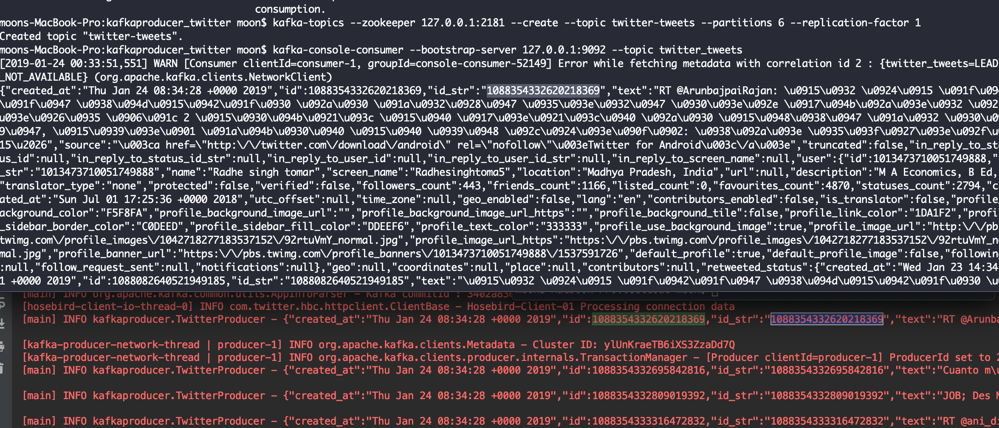

### Steps
1. Install Kafka
2. Set environment variables
3. Start zookeeper and kafka server
zookeeper-server-start config/zookeeper.properties
kafka-server-start config/server.properties

4. Need to create kafka topic separately
kafka-topics --zookeeper 127.0.0.1:2181 --create --topic twitter-tweets --partitions 6 --replication-factor 1

5. To test Kakfa producer
kafka-console-consumer --bootstrap-server 127.0.0.1:9092 --topic twitter_tweets

6. Run TwitterProducer

7. Compare outputs from terminal and IDE. 

Found that IDs from kafka producer are matched with console-consumer!

References:
    https://github.com/twitter/hbc